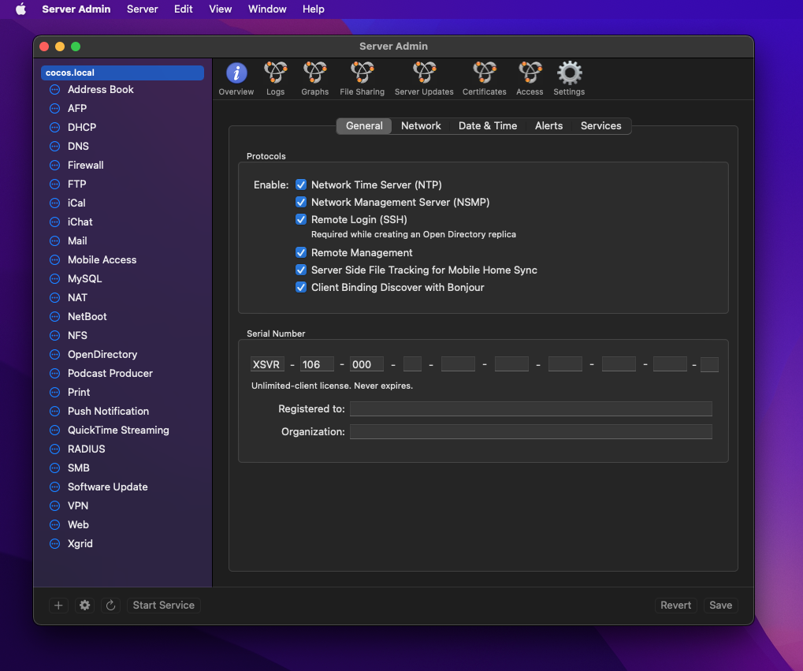

#  Server Admin.app

> User-friendly server administration, for what's left of us.

## About This Project

Are you tired of PaaS startups rehashing old
ideas that used to be implemented for free
in the open source world?

Maybe you just like running your own server(s)?

Or, maybe you just miss clicking around Apple's utility
applications.

We'll you're in luck because we are replicating 
the late, the great Mac OS X Server Admin application, 
and we're doing it in classic Mac OS X style with AppKit
and Objective-C.

Server Admin - Server administration for 
_what's left of us._

## Intentions

The intention of this project is to create an application
that mimics Server Admin.app. I am referencing a copy
of 10.6 Server that is running in a virtual machine.

I am planning on re-implementing as much of the interface 
as possible, but I can't promise that I could ever get
this to acutally manage a server. (I have made a few
attempts in the past.)

If implementing the user interface is successful, I 
may again attempt to do an implementation where this
application can connect to FreeBSD servers and manage them.

This would be a MASSIVE undertaking for a single 
engineer, though.

## License

This project is licensed under MIT.

## Guidance

This repository should represent Server Admin as closely as possible
to how it appeared and functioned in 10.6.

If you are looking to deviate, please fork this repository and make
your changes there.

If I attempt to modernize and implement functionality, I will 
also fork this repository and link to it from here.

In short, you can use this project as a starting point for your own
project.

## Maintainers

* [Ben Szymanski](https://bszyman.com)
